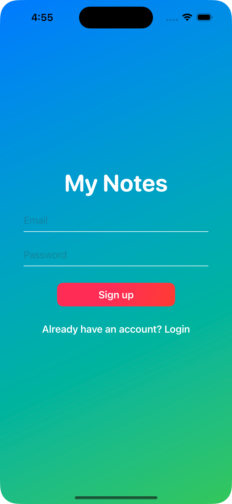
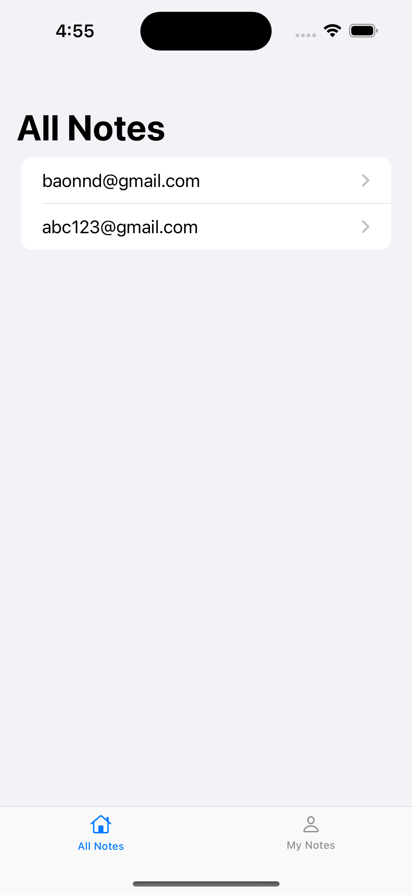
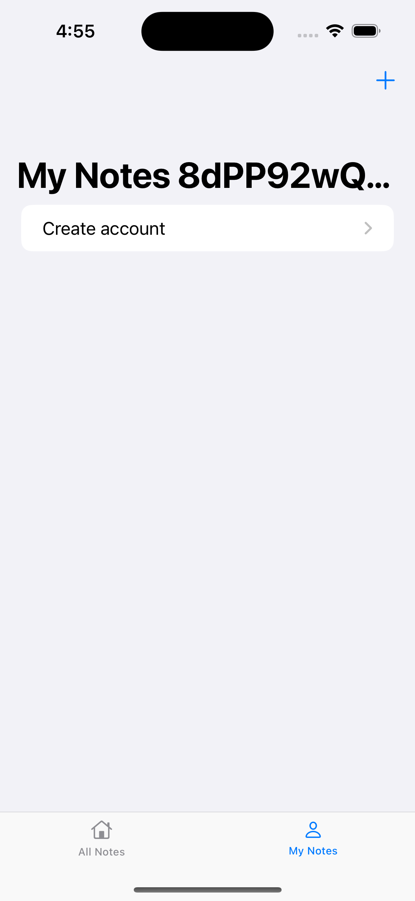
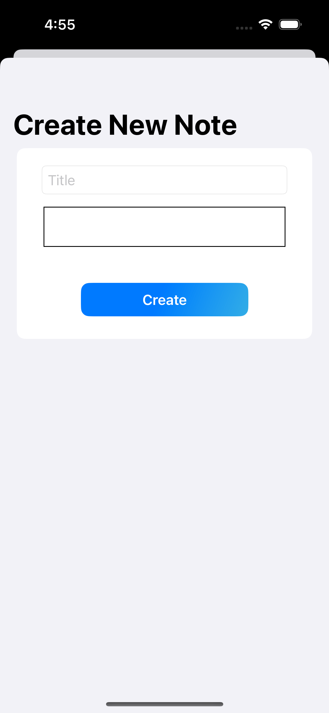

# SwiftUINotes

# Kế hoạch

## Xây dựng ứng dụng với các tính năng sau:

- Create Account
- Login Account
- Get all notes, get notes from account
- Create note
- Đây là lần đầu em code bằng SwiftUI nếu được có cơ hội để làm việc chung thì em sẽ học hỏi và trau chuốt nhiều hơn

## Login View

- Dùng để Login, SignUp account.

* Nếu có account rồi thì nhập: email, password và bấm Login
* Chưa có account thì nhập: email, password và bấm SignUp

## All Notes View

- Dùng để xem tất cả note của tất cả User

* Bấm vào từng User để xem detail note

## My Notes View

- Dùng để xem tất cả note của mình

* Bấm vào từng note để xem detail

## Create Notes View

- Dùng để tạo note
